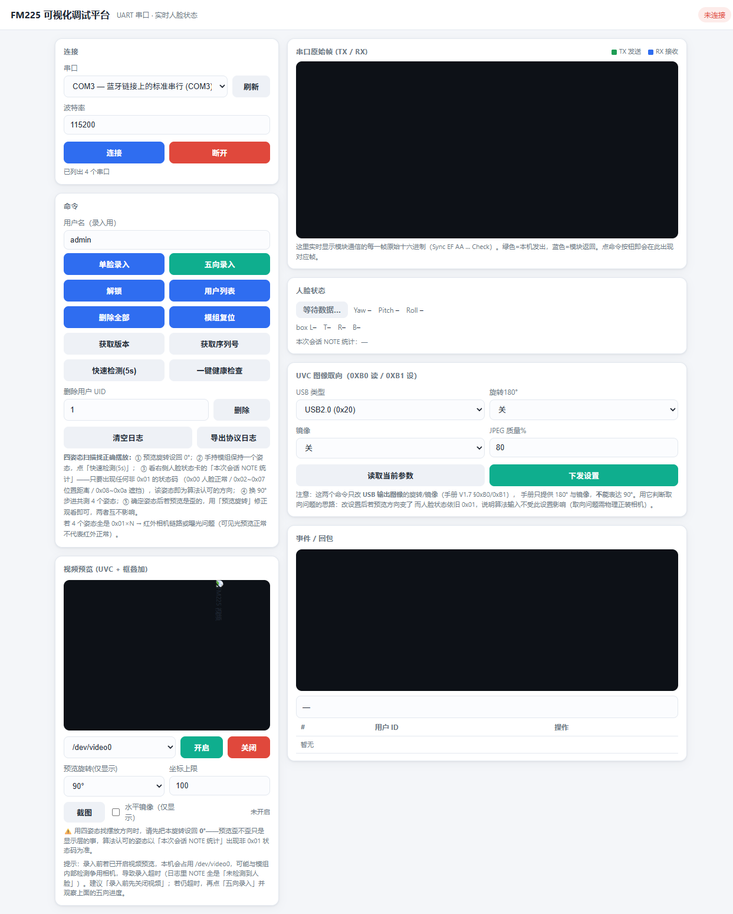

# FM225 人脸模组 Web 调试平台

> **FM225 人脸模组 Web 调试平台（FM225 Face Module Web Debugger）** —— 面向 FM225 / FM22x 双目人脸识别模组的串口协议调试工具，运行于 Linux（开发机与目标板均可）。

本平台把「**协议内核**」与「**Web 界面**」彻底分层：浏览器仪表盘只负责把结果呈现清楚，底层的二进制协议解析、串口收发、摄像头视频抓取全部在 Python 后端完成，可被单元测试与持续集成覆盖。

## web预览：



---

## 开发分工

| 模块 | 实现方式 | 说明 |
|------|----------|------|
| **串口与协议栈**（`app.py` 后台逻辑：组帧、`XOR` 校验、二进制状态机、命令/回包语义翻译、状态码表、`termios` 裸串口、`pyserial` 传输、摄像头设备诊断、人脸框叠加） | **人工手写** | 嵌入式 Linux 核心：原始串口编程、二进制协议增量解析、可移植设计 |
| **Web 前端界面**（`index.html` 仪表盘：实时帧流、命令面板、用户列表、状态灯、人脸框画布、截图与预览优化） | **AI 辅助生成** | 前台界面用于可视化呈现，非本项目核心考察点 |

项目后端协议与串口内核由作者独立实现，Web 前端由 AI 辅助生成。

---

## 架构（协议内核与界面分离）

```
FM225 模组串口(UART) ──原始字节流──▶ app.py 后台（协议状态机 / termios 裸串口 / pyserial 传输）
                                            │
                                            ├─ REST + SSE 实时推送（命令、回包、主动上报）
                                            ├─ MJPEG 视频流 + 人脸框叠加（OpenCV）
                                            └─▶ index.html 仪表盘（浏览器）
```

- **后端 `app.py`**：仅依赖 Python 标准库与 Flask / pyserial / OpenCV 三个第三方库。承载帧解析状态机（`FrameParser`）、`_pack` 组帧、应答(`REPLY`)/主动上报(`NOTE`) 语义解析、状态码翻译表、串口读取循环、摄像头视频抓取与人脸框绘制。
- **前端 `index.html`**：单页仪表盘，通过服务器推送(SSE) 接收实时帧流与状态，通过接口(REST) 下发命令。无构建步骤，浏览器直接打开。

---

## 快速开始

```bash
pip install -r requirements.txt
python3 app.py
# 浏览器打开 http://127.0.0.1:5000
```

> 硬件连接、波特率、权限与常见排查见 [`PROTOCOL.md`](./PROTOCOL.md)。

---

## 功能一览

| 能力 | 说明 |
|------|------|
| 实时帧流 | 发送(TX) / 接收(RX) / 主动上报(NOTE) / 回包 分类着色，逐帧时间戳 |
| 命令面板 | 复位、录入、解锁、用户列表等命令一键下发 |
| 用户列表 | 远程拉取模组内已录入用户与状态 |
| 人脸框叠加 | 摄像头视频流上叠加人脸检测框（OpenCV） |
| 协议解析 | EF AA 同步头 / 大端长度 / XOR 校验 / 状态机，逐字段拆解 |
| 状态码翻译 | `MR_REUSLTS` / `FACE_STATE` / `MID_NAMES` 等语义表 |

---

## 协议帧格式（摘要）

```
┌──────────┬────────┬──────────┬────────┬─────────┐
│ Sync     │ MsgID  │ Size     │ Data   │ Check   │
│ 同步头    │ 消息ID │ 长度     │ 数据   │ 校验    │
│ EF AA    │ 1B     │ 2B(大端) │ N B    │ 1B      │
└──────────┴────────┴──────────┴────────┴─────────┘
```

- **校验(Check)** = 从 `消息ID(MsgID)` 到 `数据(Data)` 末尾所有字节的 **XOR 异或**（不含同步头）。
- 消息类型(MsgType)：`0` 应答(REPLY，命令回复) / `1` 主动上报(NOTE，含人脸状态) / `2` 图像(IMAGE，JPEG)。
- 完整字段翻译见 [`PROTOCOL.md`](./PROTOCOL.md)。

---

## 目录结构

```
fm225-web-debugger/
├── app.py            # Web 平台后端（Flask + pyserial + OpenCV）★人工手写协议/串口内核
├── index.html        # Web 平台前端（仪表盘）· AI 辅助
├── requirements.txt  # Web 平台依赖
├── PROTOCOL.md       # 协议逐字段翻译
├── LICENSE
└── README.md
```

---

## 开源协议

[MIT 许可证](./LICENSE)。作者 Zhili Wang。欢迎提交 Issue 与合并请求(PR)。
